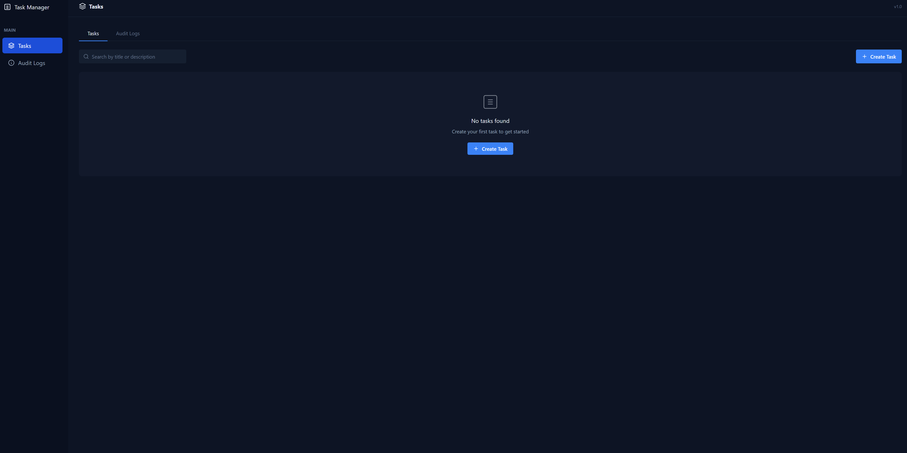

# 🚀 Task Manager Dashboard


<p align="center">
  
</p>

A secure, modern task management system with an elegant dark-themed interface. Built with React, Node.js, Express, and MongoDB, featuring real-time task tracking and comprehensive audit logging.

## ✨ Features

- **🎯 Task Management:** Create, view, update, and delete tasks
- **🔍 Search & Filter:** Find tasks quickly with instant search
- **📊 Audit Logging:** Track all changes with detailed audit logs
- **🛡️ Security:** Advanced security measures to protect your data
- **📱 Responsive Design:** Works on desktop and mobile devices
- **🎨 Modern UI:** Clean, dark-themed interface with intuitive controls

## 🛠️ Tech Stack

### Frontend
- **React:** UI library for building component-based interfaces
- **React Router:** Navigation and routing
- **Axios:** API client for HTTP requests
- **CSS3:** Custom styling for a modern look

### Backend
- **Node.js:** JavaScript runtime environment
- **Express:** Web framework for building APIs
- **MongoDB:** NoSQL database for data storage
- **Mongoose:** MongoDB object modeling

### Security Features
- **Helmet:** Secure HTTP headers
- **XSS-Clean:** Prevent cross-site scripting
- **CORS:** Cross-origin resource sharing protection
- **Input Validation:** Server-side data validation
- **Sanitization:** Prevents NoSQL injection

## 🚀 Getting Started

### Prerequisites
- Node.js (v14+ recommended)
- MongoDB (local or MongoDB Atlas)
- npm or yarn package manager

### Installation

1. **Clone the repository**
   ```bash
   git clone https://github.com/Raisahab794/task-manager-dashboard.git
   cd task-manager-dashboard
   ```

2. **Set up environment variables**
   
   Create a `.env` file in the server directory:
   ```
   MONGO_URI=your_mongodb_connection_string
   PORT=5000
   NODE_ENV=development
   ```

3. **Install backend dependencies**
   ```bash
   cd server
   npm install
   ```

4. **Start the backend server**
   ```bash
   npm start
   # Or for development with auto-restart:
   npm run dev
   ```

5. **Install frontend dependencies**
   ```bash
   cd ../client
   npm install
   ```

6. **Start the frontend application**
   ```bash
   npm start
   ```

7. **Access the application**
   
   Open your browser and navigate to `http://localhost:3000`

## 📋 API Documentation

### Tasks Endpoints

| Method | Endpoint | Description |
|--------|----------|-------------|
| GET    | /api/tasks | Get all tasks (with pagination and filtering) |
| POST   | /api/tasks | Create a new task |
| PUT    | /api/tasks/:id | Update an existing task |
| DELETE | /api/tasks/:id | Delete a task |

### Audit Log Endpoints

| Method | Endpoint | Description |
|--------|----------|-------------|
| GET    | /api/logs | Get all audit logs (with pagination) |

## 🔒 Security Implementation

This application implements several security best practices:

1. **HTTP Security Headers** via Helmet.js
2. **Input Sanitization** to prevent XSS attacks
3. **MongoDB Query Sanitization** to prevent NoSQL injection
4. **CORS Protection** with configured origins
5. **Request Rate Limiting** to prevent brute force attacks
6. **Payload Size Limiting** to prevent DoS attacks
7. **Detailed Audit Logging** for tracking system changes

## 📱 Responsive Design

The Task Manager Dashboard is built with a responsive design that works across devices:

- **Desktop:** Full feature interface with optimized spacing
- **Tablet:** Responsive layout that adapts to medium screens
- **Mobile:** Touch-friendly interface with collapsible sections

## 🤝 Contributing

Contributions are welcome! Please feel free to submit a Pull Request.

1. Fork the repository
2. Create your feature branch (`git checkout -b feature/amazing-feature`)
3. Commit your changes (`git commit -m 'Add some amazing feature'`)
4. Push to the branch (`git push origin feature/amazing-feature`)
5. Open a Pull Request

## 📜 License

This project is licensed under the MIT License - see the LICENSE file for details.

## 👨‍💻 Author

- **Your Name** - [GitHub Profile](https://github.com/Raisahab794)

## 🙏 Acknowledgments

- [React Documentation](https://reactjs.org/)
- [Express Documentation](https://expressjs.com/)
- [MongoDB Documentation](https://docs.mongodb.com/)
- [Mongoose Documentation](https://mongoosejs.com/)

---

<p align="center">
  Made with ❤️ by Ayush Rai
</p>
